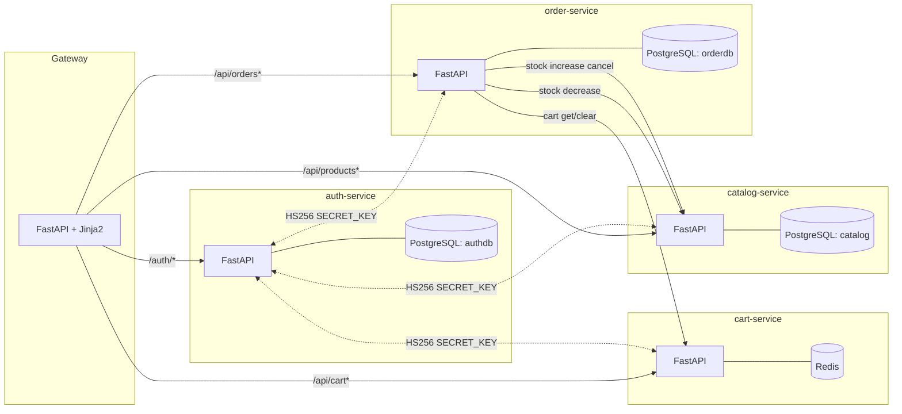
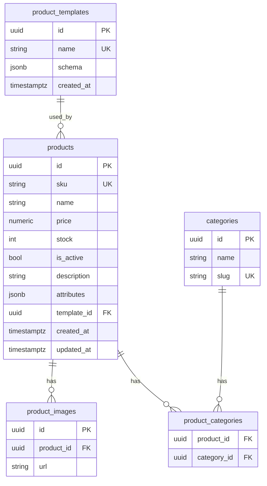
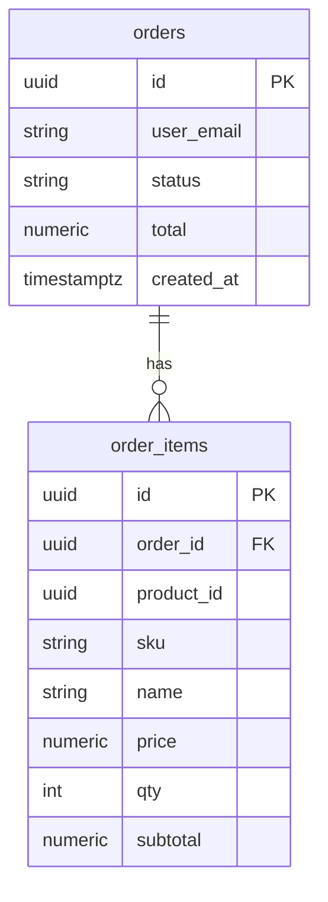

E-commerce Monorepo (Auth, Catalog, Cart, Order, Gateway)
=========================================================

Описание
--------
Монорепозиторий с микросервисами для e-commerce прототипа:
- services/auth_service — аутентификация/регистрация, JWT (PostgreSQL)
- services/catalog_service — каталог товаров (CRUD, PostgreSQL)
- services/cart_service — корзина (Redis)
- services/order_service — оформление заказов (PostgreSQL)
- services/gateway — веб‑интерфейс (FastAPI + Jinja2) и API‑прокси

Новые возможности и изменения
- Улучшенный UI: скрыта ссылка «Админ» для обычных пользователей; более контрастные цены (формат 244.500,53 ₸).
- Страница товара: `GET /product/{id}` с галереей, описанием и характеристиками.
- Картинки: поддержка списка ссылок (URL) у товаров, миниатюры в корзине, lazy‑loading, аккуратное вписывание изображений.
- Админ‑статистика: `GET /admin/stats` + `GET /api/admin/stats` — суммы, топ‑товары, низкий остаток, динамика за 7 дней.
- Шаблоны характеристик: CRUD шаблонов в каталоге (`/templates`), UI для управления — `/admin/templates`; создание товара с шаблоном и `attributes` (JSON).
- Заказы: пользователь может отменить собственный заказ; при отмене остатки возвращаются в каталог (stock восстанавливается).

Требования
----------
- Docker 24+ и Docker Compose v2
- Git (для клонирования репозитория)
- Порт `8000` свободен на хосте (для gateway)

Предварительная установка
-------------------------
- Ubuntu/Debian:

```bash
sudo apt-get update
sudo apt-get install -y docker.io docker-compose-plugin git
sudo usermod -aG docker $USER   # чтобы запускать docker без sudo
newgrp docker                    # применить группу в текущей сессии
docker --version && docker compose version && git --version
```

- macOS (Homebrew):

```bash
brew install --cask docker   # установит Docker Desktop
brew install git
# Запустите Docker.app один раз, чтобы поднять демон
docker --version && docker compose version && git --version
```

- Windows 10/11:
- Установите Docker Desktop (включите WSL2 backend), перезагрузите машину.
- Установите Git for Windows (доступен как Git Bash).
- Проверьте версии в PowerShell или Git Bash: `docker --version`, `docker compose version`, `git --version`.

- Проверка доступа к Docker (Linux):
  - Если команда `docker ps` без sudo выдаёт ошибку прав — перелогиньтесь или выполните `newgrp docker`.

Быстрый старт (Docker Compose)
------------------------------
1) Собрать и запустить:

```bash
docker compose up -d --build
```

2) Проверить статус контейнеров и логи (опционально):

```bash
docker compose ps
docker compose logs -f gateway
```

3) Открыть интерфейс:
- Gateway/UI: http://localhost:8000/
- Страница логина: http://localhost:8000/login
- Админка: http://localhost:8000/admin

По умолчанию при старте сидируется админ‑пользователь:
- email: `admin@example.com`
- пароль: `admin123`

Миграции БД применяются автоматически при старте сервисов (Alembic в `auth_service`, `catalog_service`, `order_service`). Данные сохраняются в Docker volume’ах.

Остановка и сброс
-----------------
- Остановить сервисы: `docker compose down`
- Пересобрать/перезапустить: `docker compose up -d --build`
- Полный сброс данных (удалить volumes с БД/Redis):

```bash
docker compose down -v
```

Переменные окружения (используются в compose)
--------------------------------------------
- gateway:
  - `AUTH_URL` (по умолчанию `http://auth:8000`)
  - `CATALOG_URL` (`http://catalog:8000`)
  - `CART_URL` (`http://cart:8000`)
  - `ORDER_URL` (`http://order:8000`)
  - `SECRET_KEY`
- auth_service:
  - `DATABASE_URL` (PostgreSQL)
  - `SECRET_KEY`
  - `ADMIN_EMAIL`, `ADMIN_PASSWORD` — сид админа на старте
- catalog_service:
  - `DATABASE_URL` (PostgreSQL)
  - `SECRET_KEY`
- cart_service:
  - `REDIS_URL`
  - `SECRET_KEY`
- order_service:
  - `DATABASE_URL` (PostgreSQL)
  - `SECRET_KEY`
  - `CATALOG_URL`, `CART_URL`

Полезные эндпоинты
------------------
- Gateway UI: `GET /` (список товаров), `GET /login`, `GET /admin`
- Gateway UI дополнительно: `GET /product/{id}` (карточка товара), `GET /admin/stats`, `GET /admin/templates`
- Health‑чеки: `GET /health` у каждого сервиса
- Swagger для внутренних сервисов доступен внутри docker‑сети:
  - auth: `http://auth:8000/docs`
  - catalog: `http://catalog:8000/docs`
  - cart: `http://cart:8000/docs`
  - order: `http://order:8000/docs`

Gateway API (прокси)
- Товары: `GET /api/products`, `GET /api/products/{id}`, `GET /api/products/sku/{sku}`
- Корзина: `GET /api/cart`, `POST /api/cart/add`, `POST /api/cart/set`, `POST /api/cart/remove`, `POST /api/cart/clear`
- Заказы (пользователь): `GET /api/orders`, `GET /api/orders/{id}`, `POST /api/order/checkout`, `PATCH /api/orders/{id}/cancel`
- Заказы (админ): `GET /api/admin/orders`, `PATCH /api/admin/orders/{id}/cancel`, `GET /api/admin/stats`
- Шаблоны (админ): `GET /api/templates`, `POST /api/templates`, `PATCH /api/templates/{id}`, `DELETE /api/templates/{id}`

Структура
---------
- `services/*` — исходный код сервисов
- `docker-compose.yml` — локальный запуск всего проекта
- `docs/*` — архитектура, описание окружения и API

Дополнительно
--------------
- Секреты и нестандартные параметры удобно переопределять через `docker-compose.override.yml` (не коммитить в репозиторий).
- Для полного описания архитектуры см. `docs/ARCHITECTURE.md`, окружение — `docs/ENVIRONMENT.md`, API — `docs/API.md`.

Docker шпаргалка
-----------------
- Собрать все образы: `docker compose build` (параллельно: `--parallel`, чистая сборка: `--no-cache`).
- Собрать один сервис: `docker compose build gateway`.
- Локально собрать образ без compose: `docker build -t catalog-service:dev services/catalog_service`.
- Запустить/пересобрать один сервис: `docker compose up -d --build gateway`.
- Перезапустить: `docker compose restart gateway`.
- Логи сервиса: `docker compose logs -f --tail=100 gateway`.
- Список контейнеров: `docker compose ps` (или `docker ps`).
- Войти в контейнер: `docker compose exec gateway sh` (или `bash`, если есть).
- Остановить все: `docker compose down` (с удалением данных: `docker compose down -v`).
- Очистить dangling-образы: `docker image prune` (всё неисп.: `docker system prune -f`). Внимание: может удалить кэш и сети.
- Удалить локальные образы проекта: `docker compose down --rmi local`.

Пример override для hot‑reload (локальная разработка)
----------------------------------------------------
Создайте файл `docker-compose.override.yml` рядом с `docker-compose.yml`:

```yaml
services:
  gateway:
    volumes:
      - ./services/gateway/app:/app/app:rw
    command: uvicorn app.main:app --host 0.0.0.0 --port 8000 --reload
```

После этого запустите `docker compose up -d --build gateway`. Код из хоста будет монтироваться в контейнер, `--reload` перезапускает сервер при изменениях.

Архитектура и структура
------------------------
- Монолит? Нет — здесь монорепозиторий с несколькими сервисами. Коммуникация — HTTP/JSON. Авторизация между сервисами через общий `SECRET_KEY` (HS256 JWT).
- Инфраструктура локально — `docker-compose.yml`: БД Postgres для `auth`, `catalog`, `order`, Redis для `cart`, один UI‑gateway, общая сеть, именованные volume’ы для данных.

Корень репозитория
- `docker-compose.yml` — состав окружения: сервисы, env, порты, зависимости, volume’ы.
- `docs/` — архитектура, окружение, API, структура.
- `services/` — весь продуктовый код микросервисов.
- `.python-version` — версия Python для локальной разработки (pyenv/asdf).
- `.gitignore` — игнор для артефактов сборки, окружений, IDE и т.д.

Сервисы (общие паттерны внутри `services/*/app`)
- `app/main.py` — точка входа FastAPI; создание `app`, маршруты, хелсчек, регистрация роутеров и обработчиков ошибок.
- `app/config.py` — настройки через `pydantic-settings`: чтение переменных окружения (URL БД/Redis, секрет, базовые URLs).
- `app/db.py` — инициализация подключения (Async SQLAlchemy/Redis), сессии, `health_check`.
- `app/models.py` — ORM‑модели (SQLAlchemy) и связи.
- `app/schemas.py` — Pydantic‑схемы запросов/ответов.
- `app/errors.py` — централизованные обработчики исключений, логирование.
- `app/auth.py`/`app/authz.py` — JWT‑утилиты, роли, проверка прав.
- `app/routers/*` — декларативные роуты FastAPI для групп эндпоинтов.

Миграции БД
- `alembic.ini`, `alembic/` — конфигурация Alembic; `alembic/versions/` содержит миграции (история схемы).
- Скрипты ожидания БД: `scripts/wait_for_db.py` (у `auth`, `catalog`, `order`).

Контейнеризация (каждый сервис)
- `Dockerfile` — базовый образ `python:3.12-slim`, установка зависимостей через `uv`, копирование кода, `EXPOSE 8000`.
- `pyproject.toml` — метаданные проекта и список зависимостей для установки в образ.

Kubernetes (демо отказоустойчивости)
------------------------------------
В каталоге `k8s/` есть манифесты для развёртывания стека в Kubernetes:

- Postgres + PVC (`k8s/postgres.yaml`) и Job инициализации баз (`authdb`, `catalog`, `orderdb`).
- Redis (`k8s/redis.yaml`).
- Сервисы: `auth`, `catalog`, `order`, `cart`, `gateway` (Deployments + Services).
- Секреты: `k8s/secret.yaml` — пароли/ключи и `DATABASE_URL` для сервисов.
- Ingress для публикации `gateway`: `k8s/ingress.yaml`.

Реплики для отказоустойчивости:
- `gateway` и `cart` — `replicas: 2` (статлесс, масштабируются из коробки).
- `auth`, `catalog`, `order` — `replicas: 1` (так как на старте выполняют миграции Alembic). После первого запуска можно увеличить: `kubectl scale deploy/catalog --replicas=2` и т.д.

Как запустить в minikube
1) Подключить Docker демона minikube:
```bash
eval $(minikube -p minikube docker-env)
```
2) Собрать образы локально (из корня репозитория):
```bash
docker build -t auth-service:local services/auth_service
docker build -t catalog-service:local services/catalog_service
docker build -t order-service:local services/order_service
docker build -t cart-service:local services/cart_service
docker build -t gateway:local services/gateway
```
3) Применить манифесты:
```bash
kubectl apply -f k8s/secret.yaml
kubectl apply -f k8s/postgres.yaml
kubectl apply -f k8s/redis.yaml
kubectl apply -f k8s/auth.yaml -f k8s/catalog.yaml -f k8s/order.yaml -f k8s/cart.yaml -f k8s/gateway.yaml
```
4) Доступ к приложению:
- Порт‑форвард: `kubectl port-forward svc/gateway 8000:8000` → http://localhost:8000
- Через Ingress (minikube):
  - Включить: `minikube addons enable ingress`
  - Применить: `kubectl apply -f k8s/ingress.yaml`
  - Добавить хост в `/etc/hosts`: `echo "$(minikube ip) shop.local" | sudo tee -a /etc/hosts`
  - Открыть: http://shop.local

Примечания
- Для продакшена Postgres/Redis лучше вынести во внешние управляемые сервисы или кластера; текущие манифесты — для демо.
- Миграции БД сейчас запускаются в entrypoint контейнеров; в проде выносите в `Job`/`initContainer`.
- Добавьте `resources.requests/limits`, HPA и мониторинг по необходимости.

- `docker-entrypoint.sh` — порядок запуска: ожидание БД → `alembic upgrade head` → `uvicorn`.

Специфика отдельных сервисов
- gateway
  - `templates/` — Jinja2‑шаблоны (`index.html`, `login.html`, `admin*.html` и др.).
  - `static/` — статические файлы (CSS/JS/изображения).
  - Читает `AUTH_URL`, `CATALOG_URL`, `CART_URL`, `ORDER_URL`; проксирует запросы и рендерит UI.
- auth_service
  - Таблица пользователей, сид админа через `ADMIN_EMAIL`/`ADMIN_PASSWORD` на старте.
  - Эндпоинты `/auth/register`, `/auth/login` (OAuth2 form), `/health`.
- catalog_service
  - CRUD товаров, админ‑права на изменение, `is_active`, склад `stock`.
- cart_service
  - Redis‑хранилище корзины по пользователю (`cart:{sub}`), операции add/remove/list.
- order_service
  - Оркестрация оформления заказа: чтение корзины, проверка каталога, резерв/списание stock (через админ‑токен), запись заказа.

Где менять что
- Добавить поле к пользователю/товару/заказу: модель в `app/models.py` → миграция в `alembic/versions/` → схемы в `app/schemas.py` → обработка в роутерах/сервисах.
- Новые эндпоинты: создайте/расширьте роутер в `app/routers/*` и подключите его в `app/main.py`.
- Новые переменные окружения: объявите в `app/config.py` и прокиньте через `docker-compose.yml`.
- UI правки: правьте Jinja2 в `services/gateway/templates` и стили в `services/gateway/static`.
- Политики доступа: правьте `app/auth.py`/`authz.py` и проверки ролей в обработчиках.

Каталог: расширения API и данные
- Товар теперь поддерживает поля: `images: list[str]` (URL), `description: str | null`, `attributes: object | null`, `template_id: UUID | null`.
- Новые/расширенные ручки каталога:
  - `GET /products/sku/{sku}` — поиск по точному SKU.
  - `POST /products` — принимает `images`, `description`, `attributes`, `template_id`.
  - `PATCH /products/{id}` — может заменить список `images` и обновить доп. поля.
  - Шаблоны: `GET/POST/PATCH/DELETE /templates`.

Заказы: отмена и возврат остатков
- Пользователь может отменить свой заказ: `PATCH /api/orders/{id}/cancel` (gateway) → `PATCH /orders/{id}/cancel` (order_service).
- При первой отмене сервис заказов возвращает списанные остатки в каталоге.

Отображение цен и картинок
- Цены форматируются как `1.234.567,89 ₸` (и в UI, и в прокси/шаблонах).
- Изображения в каталоге «вписываются» без кропа; в корзине показываются миниатюры для наглядности.

Примечание по миграциям каталога
- Добавлена ревизия `0002_product_meta` (описание/характеристики/шаблоны). Если ранее ловили ошибку длины revision при апгрейде — пересоберите образ `catalog` с `--no-cache` и перезапустите.

Архитектура сервисов и Docker-компоненты
----------------------------------------
- Сервисы (контейнеры)
  - `gateway` — UI (FastAPI + Jinja2), прокси к backend’ам. Порт: `8000:8000` (публикуется на хост).
  - `auth` — авторизация и пользователи (FastAPI + Postgres, SQLAlchemy async).
  - `catalog` — каталог (FastAPI + Postgres, SQLAlchemy async, Alembic). Хранит товары, картинки (URL), описание, характеристики, шаблоны.
  - `cart` — корзина (FastAPI + Redis). Ключи вида `cart:{sub}`.
  - `order` — заказы (FastAPI + Postgres). Оркестрация checkout, отмена и возврат остатков.
  - `auth-db`, `catalog-db`, `order-db` — PostgreSQL 16 (по одному на сервис).
  - `cart-redis` — Redis 7 для корзины.

- Сети и DNS
  - Все контейнеры в общей сети Compose (по умолчанию `<project>_default`).
  - Обращение между сервисами по DNS-именам: `http://auth:8000`, `http://catalog:8000`, `http://cart:8000`, `http://order:8000`.
  - UI доступен с хоста: `http://localhost:8000` (или другой порт, если измените в compose).

- Тома (данные)
  - `auth_pgdata`, `catalog_pgdata`, `order_pgdata` — данные Postgres.
  - Redis данных по умолчанию не сохраняет (команда `--appendonly no`).

Топология (взаимодействия)


Потоки данных
- Логин
  - Gateway → Auth: POST `/auth/login` (формы OAuth2). Auth возвращает JWT, Gateway ставит cookie `access_token` (HttpOnly) → пользователь аутентифицирован в UI.
- Каталог
  - Gateway → Catalog: список/фильтры/детали товаров; админские операции (создание/редактирование/удаление) требуют JWT с ролью `admin`.
- Корзина
  - Gateway → Cart: GET/POST изменения корзины, авторизация через `Authorization: Bearer <JWT>`. Идентификатор корзины — `sub` из токена.
- Оформление заказа (checkout)
  - Gateway → Order: POST `/orders/checkout` с JWT пользователя.
  - Order: читает корзину из Cart → валидирует каждую позицию в Catalog → уменьшает остатки (PATCH в Catalog с админ-токеном) → сохраняет заказ → очищает корзину.
- Отмена заказа
  - Пользователь или админ → Order: PATCH `/orders/{id}/cancel`.
  - Order: меняет статус на `canceled`, возвращает остатки в Catalog (PATCH).

Назначение Docker-слоёв по шагам
- Базы (`auth-db`, `catalog-db`, `order-db`) поднимаются первыми; сервисы ждут готовности БД через `scripts/wait_for_db.py` и применяют Alembic миграции.
- `auth`: при старте сидирует админа (если БД пуста) или по `ADMIN_EMAIL/ADMIN_PASSWORD`.
- `catalog`: применяет миграции, включает обработку изображений (URL), описания/характеристик, шаблонов.
- `order`: ждёт `catalog` и `cart` (для формирования/отмены заказа).
- `gateway`: публикуется на `localhost:8000`, отдаёт UI и проксирует вызовы к backend’ам.

ER-диаграммы (упрощённо)

Каталог (PostgreSQL)


Заказы (PostgreSQL)


Диагностические команды
- Проверить здоровье сервисов из контейнера gateway:
  - `docker compose exec gateway curl -s http://auth:8000/health`
  - `docker compose exec gateway curl -s http://catalog:8000/health`
  - `docker compose exec gateway curl -s http://order:8000/health`
  - `docker compose exec gateway curl -s http://cart:8000/health`

Частые вопросы
- “Почему не вижу админку?” — ссылка «Админ» показывается только при `role=admin` в JWT (логин админом, по умолчанию `admin@example.com / admin123`).
- “Картинки не грузятся” — внешние сайты могут защищаться от хотлинка. В этом случае добавьте свой хостинг изображений или настройте image‑proxy/кэш (можно реализовать в gateway).
- “Цены отображаются с точкой” — UI форматирует цены в `1.234.567,89 ₸`. Если видите иначе, обновите страницу/кэш или проверяйте бэкенд-данные.

Image Proxy (опционально)
-------------------------
Чтобы стабильно отображать внешние изображения (разные домены, большие размеры, защита от хотлинка) и приводить их к единому виду, можно включить «прокси изображений» в gateway.

Идея
- Маршрут gateway — например, `GET /img?url=<...>&w=300&h=300&fit=contain`.
- Gateway скачивает оригинал (по allow‑list доменов), ресайзит через Pillow, кэширует на диске и отдаёт с правильными заголовками кеширования.
- В шаблонах вместо прямых URL использовать `/img?...`.

Предлагаемая конфигурация (ENV)
- `IMAGE_PROXY_ENABLED=true|false` — включить/выключить (по умолчанию: выключено).
- `IMAGE_PROXY_MAX_SIZE_MB=5` — лимит размера загружаемого оригинала.
- `IMAGE_PROXY_TIMEOUT=5` — таймаут загрузки, секунд.
- `IMAGE_PROXY_CACHE_DIR=/tmp/image-cache` — путь к локальному кэшу.
- `IMAGE_PROXY_ALLOWED_HOSTS=example.com,images.example.org` — список разрешённых доменов (обязательно для безопасности).

Параметры запроса
- `url` — обязательный, абсолютная HTTPS‑ссылка на изображение.
- `w`, `h` — целевые ширина/высота (px), разумные пределы (например, 64..1600).
- `fit` — `contain` (по умолчанию) или `cover`.
- `q` — качество JPEG/WebP (0..95), дефолт 85.

Эскиз реализации (в gateway)
- Добавить зависимость: Pillow (и, при желании, `filetype`/`python-magic` для валидации MIME).
- Маршрут `/img` в `services/gateway/app/main.py`:
  - Проверить `IMAGE_PROXY_ENABLED` и домен `url` ∈ `IMAGE_PROXY_ALLOWED_HOSTS`.
  - Скачивание через httpx с таймаутами и ограничением размера (stream, проверка Content‑Length).
  - Ресайз Pillow: `Image.thumbnail` для fit=contain, `ImageOps.fit` для fit=cover.
  - Кэш‑ключ: SHA256(`url` + `w` + `h` + `fit` + `q`).
  - Отдача `image/webp` или `image/jpeg` (content negotiation по `Accept`, опционально).
  - Заголовки: `Cache-Control: public, max-age=31536000, immutable`.

Подключение в шаблонах
- Главная/карточка товара:
  - Было: ``
  - Станет: ``
- Корзина/миниатюры: `w=64&h=64`.

Безопасность и ограничения
- Строгий allow‑list доменов обязателен.
- Вводите лимиты размера и таймауты, чтобы избежать DoS/oversize загрузок.
- Разрешайте только HTTPS источники, либо прокси за корпоративным шлюзом.
- Храните кэш в отдельном томе (если нужно переживать рестарты): добавьте volume и смонтируйте его в gateway.

Альтернатива
- NGINX с `image_filter` (не всегда доступен) или внешний CDN (Cloudflare Images, Imgix, etc.). В этом случае UI использовать прямые ресайз‑URL CDN.

Нужно — реализую прямо в gateway с флагом ENV, добавлю зависимости и маршруты, подключу в шаблоны и задокументирую параметры.

Диагностика и здоровье
- Health‑эндпоинты `GET /health` у всех сервисов проверяют доступность зависимостей (БД/Redis).
- Общие логи и обработка ошибок — через `app/errors.py`; логи смотрите `docker compose logs -f <service>`.

Структура по сервисам (мини‑деревья)
------------------------------------

Auth Service (`services/auth_service`)
```text
auth_service/
├─ Dockerfile                  # Образ сервиса (uv, uvicorn, deps)
├─ pyproject.toml              # Зависимости и метаданные пакета
├─ README.md                   # Локальные заметки сервиса
├─ alembic.ini                 # Конфиг Alembic
├─ alembic/                    # Миграции БД (versions/*)
├─ scripts/
│  └─ wait_for_db.py          # Ожидание готовности Postgres
├─ docker-entrypoint.sh        # Старт: wait → alembic upgrade → uvicorn
└─ app/
   ├─ main.py                 # FastAPI app, роутеры, /health
   ├─ config.py               # Pydantic Settings (DATABASE_URL, SECRET_KEY, ...)
   ├─ db.py                   # AsyncSession, engine, health_check
   ├─ models.py               # SQLAlchemy модели (User и др.)
   ├─ schemas.py              # Pydantic схемы запросов/ответов
   ├─ auth.py                 # Хеширование паролей, JWT утилиты
   ├─ errors.py               # Логирование и обработчики исключений
   └─ routers/
      └─ auth.py             # /auth/register, /auth/login, пр.
```

Catalog Service (`services/catalog_service`)
```text
catalog_service/
├─ Dockerfile
├─ pyproject.toml
├─ README.md
├─ alembic.ini
├─ alembic/
├─ scripts/
│  └─ wait_for_db.py
├─ docker-entrypoint.sh
└─ app/
   ├─ main.py                 # Подключение роутеров каталога
   ├─ config.py
   ├─ db.py
   ├─ models.py               # Product, Category и связи
   ├─ schemas.py
   ├─ errors.py
   ├─ authz.py                # Проверки ролей/прав для изменения каталога
   └─ routers/
      └─ products.py         # CRUD эндпоинты каталога
```

Cart Service (`services/cart_service`)
```text
cart_service/
├─ Dockerfile
├─ pyproject.toml
└─ app/
   ├─ main.py                 # Эндпоинты корзины (Redis), OAuth2 токен
   └─ config.py               # REDIS_URL, SECRET_KEY
```

Order Service (`services/order_service`)
```text
order_service/
├─ Dockerfile
├─ pyproject.toml
├─ alembic.ini
├─ alembic/
├─ docker-entrypoint.sh
└─ app/
   ├─ main.py                 # Checkout: читает Cart, валидирует Catalog, пишет Order
   ├─ config.py               # DATABASE_URL, CATALOG_URL, CART_URL, SECRET_KEY
   ├─ db.py                   # AsyncSession/engine, health_check
   ├─ models.py               # Order, OrderItem
   ├─ schemas.py              # Pydantic DTO
   └─ scripts/
      └─ wait_for_db.py
```

Gateway (`services/gateway`)
```text
gateway/
├─ Dockerfile
├─ pyproject.toml
├─ README.md
├─ app/
│  ├─ main.py                 # FastAPI, прокси к сервисам, cookie JWT
│  └─ config.py               # AUTH_URL, CATALOG_URL, CART_URL, ORDER_URL, SECRET_KEY
├─ templates/                 # Jinja2 шаблоны (index, login, admin, orders, ...)
└─ static/                    # CSS/JS/изображения
```

Подсказки по модификации
- Новая таблица/поле: `models.py` → миграция в `alembic/versions` → обновить `schemas.py` → поправить обработчики в `routers/*`/`main.py`.
- Новой сервисный клиент/интеграция: добавить конфиг в `config.py`, использовать `httpx` в `main.py`/роутерах, прокинуть env через `docker-compose.yml`.
- Политики доступа: обновить `auth.py`/`authz.py` и места проверки ролей в обработчиках.
